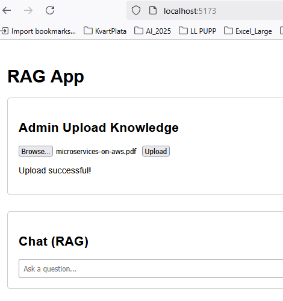
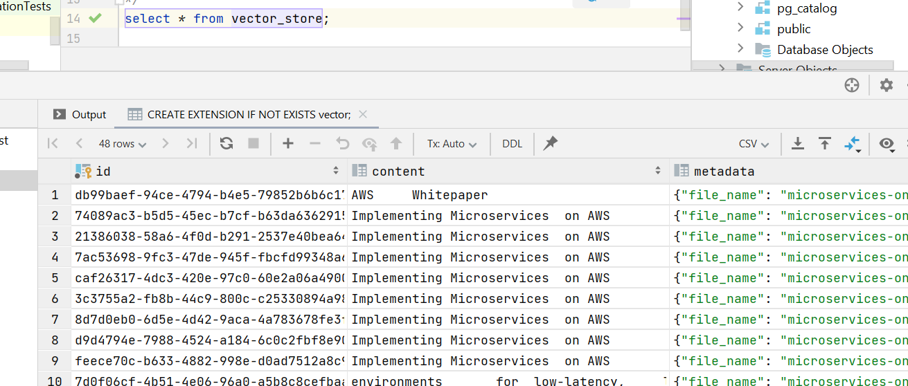
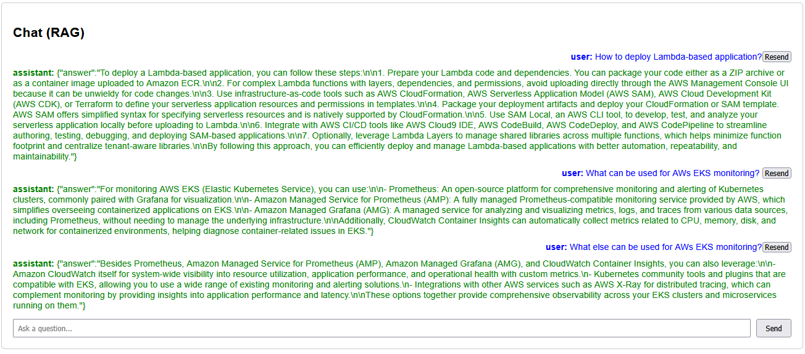

# Retrieval-Augmented Generation (RAG)

## 📚 Learning Objectives
- Understand what is Retrieval-Augmented Generation
- Learn how to use embeddings with RAG

## 📑 Task

### Goal
You need to implement a simple application that uses RAG approach to generate text based on  the knowledge source.
There are not any restrictions on the approach to application development.
You can write a console or web application, you can use any database, etc...
You can use functions or just retrieve knowledge in the method and add it as a context in query that you are sending to the model.

There are two requirements for the application.:
- Application should have ability to upload new information and use it as a knowledge source.
- Application should have ability to generate text based on the knowledge sources.

#### Evaluation Criteria
1. Text Generation Based on Knowledge Sources
- Implemented the ability to generate text based on the uploaded knowledge sources
- Verified that the generated text is relevant and accurate based on the knowledge sources

## API Endpoints

Method | Endpoint | Description  
POST | /api/ask | Ask a question to the AI  
POST | /api/upload | Upload new knowledge context  

## Application uploads new information and use it as a knowledge source.
The following file was embedded [AWS Whitepaper Implementing Microservices on AWS](https://docs.aws.amazon.com/pdfs/whitepapers/latest/microservices-on-aws/microservices-on-aws.pdf)

and then check DB

## Application generates text based on the knowledge sources.

